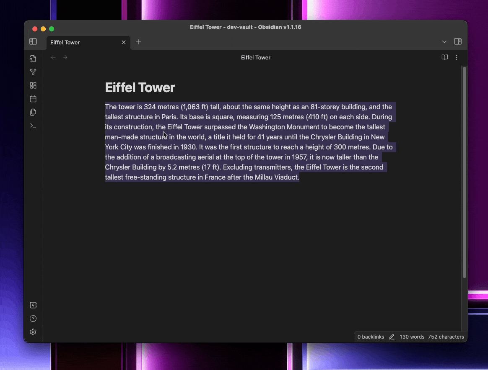

# 🤗📝 Hugging.md

HuggingFace assisted Obsidian plugin, bundling text inferences e.g. summarization, paraphrasing or other text generation available in HuggingFace as commands. Currently work-in-progress and haven't sent to Obsidian community plugins.

**Current Feature(s)**

-   Summarize selected text (as proof-of-concept)
    

## Installation

-   Clone this repository to vault `.obsidian/plugins` directory
-   `pnpm install` to install dependencies
-   `pnpm build` to build
-   Refresh installed community plugins and enable Hugging.md

For those who use [Warp.terminal](https://www.warp.dev/) you can copy workflow `push-to-local-sample.yaml` to new one, change parameters and run workflow to push build files to vault plugin folder.
